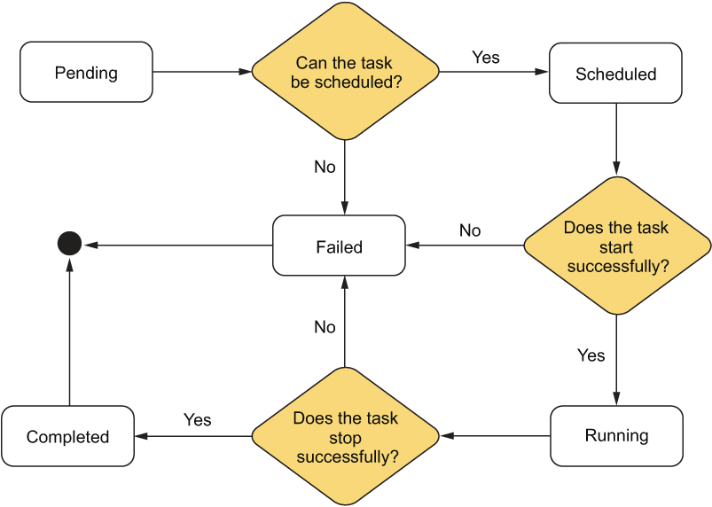

# General Notes about the Architecture

## Introduction: The components of an orchestration system
1. The task
2. The job
3. The scheduler
4. The manager
5. The worker
6. The cluster
7. The command-line interface (CLI)

### Bird's eye view

---
## The Task
A task core specification is:
1. The amount of `memory`, `CPU`, and `disk` it needs to run effectively
2. What the orchestrator should do in case of failures, typically called a `restart policy`
3. The name of the `container image` used to run the task

### Task States

---
## The Job (TODO)
- The job is an aggregation of tasks. 
  - It has one or more tasks that typically form a larger logical grouping of tasks to perform a set of functions.
  - For example, a job could be comprised of a RESTful API server and a reverse proxy.

### Kubernetes and the concept of a job
- In Kubernetes land, a job is a specific type of workload that has historically been referred to as a `batch job`
  - `batch job` is a job that starts and then runs to completion. 

- Kubernetes has multiple resource types that are Kubernetes-specific implementations of the job concept:
  1. Deployment
  2. ReplicaSet
  3. StatefulSet
  4. DaemonSet
  5. Job

### Our job Specification
- A job should specify details at a high level and will apply to all tasks it defines:
  1. Each task that makes up the job
  2. Which data centers the job should run in
  3. How many instances of each task should run
  4. The type of the job (should it run continuously or run to completion and stop?)

- We won’t be dealing with jobs in our implementation for the sake of simplicity. 
  - Instead, we’ll work exclusively at the level of individual tasks.

---
## The scheduler
- The scheduler is responsible for deciding which worker should run a task. 
  - It does this by looking at the task’s requirements and the current state of the cluster.
  - Algorithms could be: 
    - **round-robin** or
    - Enhanced Parallel Virtual Machine (E-PVM) scheduler (used as part of Google’s Borg scheduler)

- The scheduler should perform these functions:
  1. Determine a set of candidate machines on which a task could run
  2. Score the candidate machines from best to worst
  3. Pick the machine with the best score
---
## The manager
-  To run jobs in the orchestration system, users submit their jobs to the manager. 
- The manager, using the scheduler, then finds a machine where the job’s tasks can run. 
- The manager also periodically collects metrics from each of its workers.
  - which are used in the scheduling process.
- The manager is a logical representation of the cluster.
  - Its one type of node
- The manager should do the following:
  1. Accept requests from users to start and stop tasks.
  2. Schedule tasks onto worker machines.
  3. Keep track of tasks, their states, and the machine on which they run.

---
## The worker
- The worker is the logical representation of a machine in the cluster.
  - The node is the physical machine.
  - The worker is a type of node.
- Is responsible for running the tasks assigned to it by the manager. 
- If a task fails for any reason, it must attempt to restart the task. 
- The worker also makes metrics about its tasks and overall machine health available for the manager to poll.

- The worker is responsible for the following:
  1. Running tasks as Docker containers
  2. Accepting tasks to run from a manager
  3. Providing relevant statistics to the manager for the purpose of scheduling tasks
  4. Keeping track of its tasks and their states

### The worker components

---
## The cluster
- The cluster is the logical grouping of all the previous components.

---
## The command-line interface (CLI)
The main user interface, should allow a user to:
1. Start and stop tasks
   2. Get the status of tasks
   3. See the state of machines (i.e., the workers)
   4. Start the manager
   5. Start the worker