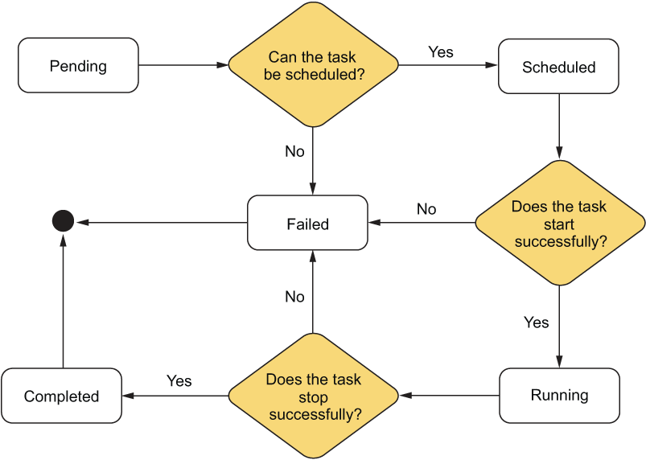
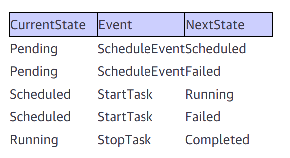
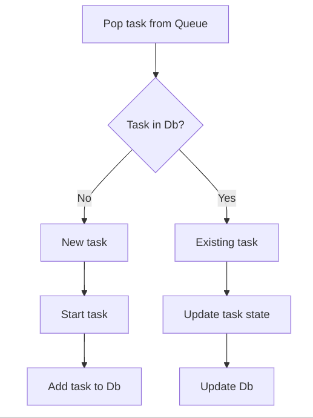

# Task Related Notes and Thoughts

## How it works
### Task States and Transitions
- the states

- the transitions

### Handling Task Transitions
There are two possible scenarios for handling tasks:
1. A task is being submitted for the `first time`, so the worker will not know about it.
2. A task is being submitted for the `n_th` time, where the task submitted represents the desired state to which the current task should transition.

#### Naive Heuristic
- When processing the tasks it receives from the manager, the worker will need to determine which of these scenarios it is dealing with.
- The worker uses two main data structures:
  - Queue: Represents the desired state of tasks
  - Db: Represents existing tasks (already seen at least once)

- Queue interpretation:
  - Each item in the **Queue** is interpreted as `put task t in state s`

- Task processing:
  - Worker pops a task off the Queue
  - Checks if the task exists in the Db

- Task categorization:
  - If task is in Queue but not in Db:
    - It's a new task
    - Default action: **Start** the task
  - If task is in both Queue and Db:
    - It's an existing task
    - Action: Update its state as specified

- State management:
  - The worker updates the task's state in the Db based on the Queue instruction

---
## TODOs and Spin-offs

### Missing Features in using Docker SDK
- Add support for network config
- Add support for platform config

### CRI
- Write a simple CRI (Container Runtime Interface) to support multiple container runtimes
  - maybe use your version of the container runtime (like docker engine)

### Config
- Add support for config file to store and read the configuration of the task

### Control Loop
- Define and clone the control loop from Kubernetes
  - It is a pattern used to manage the state of the system
#### Simple Summary of the Control Loop
- Those are the key concepts of the control loop in Kubernetes:
  1. **Desired State:** Users declare the desired state of their apps and infra using YAML or JSON manifests.
  2. **Current State:** K8s continuously monitors the current state of the cluster.
  3. **Reconciliation:** Various controllers in K8s work to reconcile the current state with the desired state.
  4. **State Transitions:** As changes occur, resources move through different states (e.g., Pending, Running, Terminated for Pods).
  5. **Event-driven:** The system reacts to changes and events, triggering appropriate actions to maintain or achieve the desired state.
- This model allows Kubernetes to be self-healing and adaptable to changes in the cluster environment.
