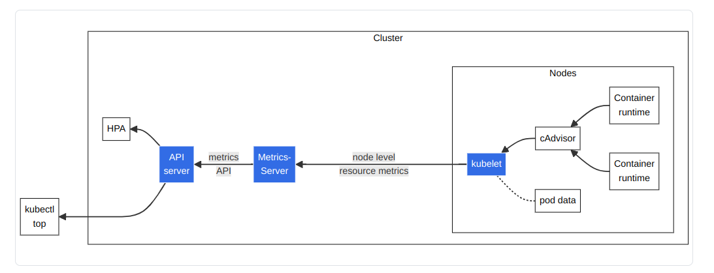

# Task Related Notes and Thoughts

## How it works

---
## TODOs and Spin-offs

### Metrics
- Now i am relying on the /proc filesystem to get the metrics of the machine (cpu, memory, etc)

#### K8s Metrics from the [k8s docs](https://kubernetes.io/docs/tasks/debug/debug-cluster/resource-metrics-pipeline/)
- K8s has a more sophisticated way of getting the metrics of the machine and the pods running on it
  

- The architecture components consist of the following:
  1. **cAdvisor:** Daemon for collecting, aggregating and exposing container metrics included in Kubelet.
  2. **kubelet:** Node agent for managing container resources. 
     - Resource metrics are accessible using the /metrics/resource and /stats kubelet API endpoints.
  3. **node level resource metrics:** API provided by the kubelet for discovering and retrieving per-node summarized stats available through the /metrics/resource endpoint.
  4. **metrics-server:** Cluster addon component that collects and aggregates resource metrics pulled from each kubelet. 
     - The API server serves Metrics API for use by HPA, VPA, and by the kubectl top command. 
     - Metrics Server is a reference implementation of the Metrics API.
  5. **Metrics API:** Kubernetes API supporting access to CPU and memory used for workload autoscaling.

#### TODO
- First use cAdvisor to get the metrics of the containers
